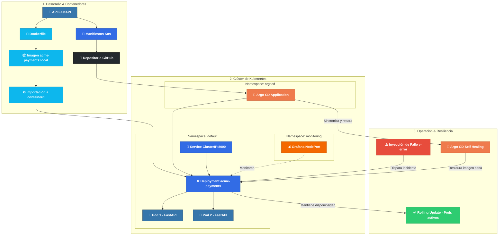

# 🚀 Acme Payments - GitOps & Cloud-Native Ecosystem

Prototipo de microservicio de pagos de alta disponibilidad con entrega continua, observabilidad y autorrecuperación en Kubernetes.

## 🗺️ Roadmap del Proyecto

- [x] **Fase 1: Containerización y Microservicio Base**
  - [x] API REST ligera desarrollada con FastAPI y Python.
  - [x] Construcción de imagen en Docker e importación al almacenamiento de `containerd`.
- [x] **Fase 2: Estrategia GitOps con Argo CD**
  - [x] Definición de manifiestos K8s declarativos (`Deployment`, `Service`).
  - [x] Despliegue de Argo CD con sincronización automática (*Self-Healing* y *Prune*).
- [x] **Fase 3: Observabilidad y Monitoreo**
  - [x] Configuración de Grafana mediante Helm para la visualización de métricas del clúster.
  - [x] Aislamiento de componentes en el namespace dedicado `monitoring`.
- [x] **Fase 4: Ingeniería de Resiliencia e Incidentes**
  - [x] Inyección controlada de errores de despliegue (`ImagePullBackOff`).
  - [x] Validación de disponibilidad continua mediante la estrategia de *RollingUpdate*.
  - [x] Sincronización e imposición de estado deseado vía Argo CD Sync.

