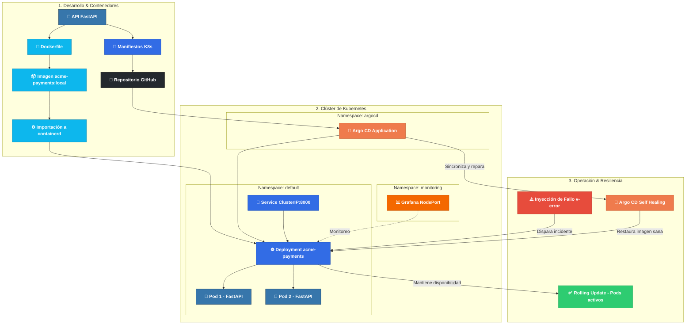

# 🚀 Acme Payments - GitOps & Cloud-Native Ecosystem

Prototipo de microservicio de pagos de alta disponibilidad con entrega continua, observabilidad y autorrecuperación en Kubernetes.

## 🗺️ Roadmap del Proyecto

1. Fase de Desarrollo y Contenedores (subgraph DEV)
Esta fase abarca el ciclo inicial de construcción de la aplicación y la preparación de la infraestructura como código (IaC):

🐍 API FastAPI (app/main.py): Es el punto de entrada de la aplicación desarrollada en Python. Expone los endpoints de negocio (servicios de pagos) y de diagnóstico (/health).

🐳 Dockerfile & 📦 Imagen (acme-payments:local): Define el entorno de ejecución ligero y optimizado. Se empaqueta la aplicación en una imagen de contenedor.

⚙️ Importación a containerd: En lugar de depender de un registro público o externo durante el desarrollo local, la imagen compilada se carga directamente dentro del runtime nativo de containerd del nodo del clúster.

📄 Manifiestos K8s & 🐙 Repositorio GitHub: Se definen los archivos de configuración declarativa (deployment.yaml y service.yaml). Todo el código y los manifiestos se suben a GitHub, el cual actúa como la única fuente de verdad (Single Source of Truth) del sistema.

2. Clúster de Kubernetes y Control GitOps (subgraph K8S)
Representa el estado interno del clúster de Kubernetes, organizado de forma modular mediante Namespaces:

🐙 Namespace argocd (Motor GitOps):

Argo CD Application (acme-payments-gitops): Escanea continuamente el repositorio de GitHub. Si detecta cambios en el código o en los manifiestos, o una desviación en el clúster, aplica automáticamente los cambios mediante políticas de Self-Healing y Prune.

☸️ Namespace default (Capa de Aplicación):

Service ClusterIP (port: 8000): Punto de acceso interno que recibe las peticiones y las distribuye equilibradamente entre las réplicas activas.

Deployment acme-payments: Gestiona el ciclo de vida y la cantidad de réplicas requeridas.

Pods (Pod 1 y Pod 2): Instancias de la API corriendo en paralelo en estado Running para garantizar alta disponibilidad.

📊 Namespace monitoring (Capa de Observabilidad):

Grafana: Desplegado mediante Helm, monitorea en tiempo real las métricas del clúster, el estado de salud de los pods y la disponibilidad del servicio.

3. Operación, Resiliencia y Autorrecuperación (subgraph OPS)
Explica cómo reacciona el sistema ante fallos o alteraciones manuales no autorizadas en producción:

⚠️ Inyección de Fallo: Se simula un error operativo (por ejemplo, modificando manualmente la imagen del Deployment a una versión inexistente acme-payments:v-error).

✅ Resiliencia mediante Rolling Update: Kubernetes detecta que las nuevas réplicas fallan (ImagePullBackOff) y frena el despliegue de inmediato, manteniendo los Pods sanos anteriores en ejecución. El servicio nunca se cae (Zero Downtime).

🔄 Autorrecuperación con Argo CD (Self-Healing): Argo CD detecta la discrepancia (drift) entre lo que está corriendo en el clúster y el estado deseado en GitHub.

✨ Restauración: Argo CD fuerza una sincronización automática (Sync), elimina los pods fallidos y restaura el Deployment a la imagen estable declarada en Git (acme-payments:latest), devolviendo el clúster a un estado 100% saludable de forma autónoma.

